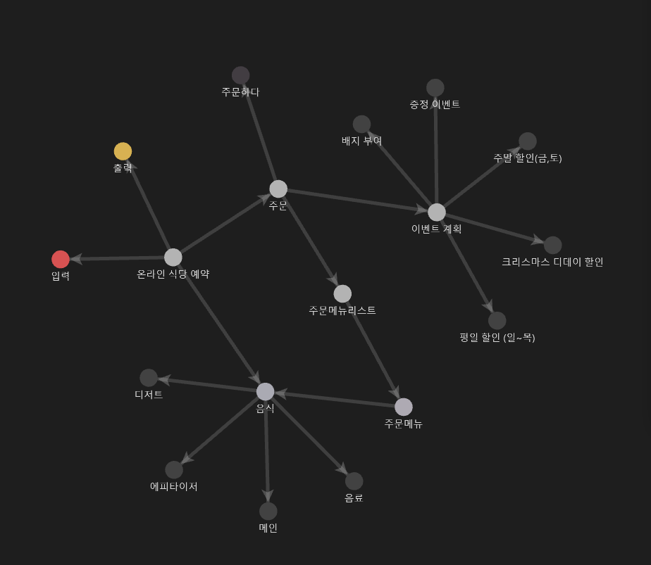

## 개념도

### 초기 구현

## 구현 현황
### (23.11.19)
- [x] 개념도 설계 및 구현계획 작성 
- [x] 음식,주문, 주문목록, 주문메뉴 구현
- [x] 테스트 코드 구현
  - 음식 : 문자열로 Enum 반환 검증
  - 주문메뉴 : 메뉴가격, 문자열로 주문메뉴 반환 검증
  - 주문목록 : 총 가격 반환 검증 
## 플로우
1. 사용자 - 예약 방문 날짜 입력
2. 사용자 - 주문 메뉴와 개수를 입력
3. 식당 - 
- [주문 메뉴] 
- 할인 전 총 금액
- [증정 메뉴]
- 혜택 내역
- 총 혜택 금액
- 할인 후 예상 실제 결제 금액 
- [12월 이벤트 배지]

## 구현 기능 목록

### 1. 주문 입력 및 유효성 검증 기능

-[ ] 사용자로부터 주문할 메뉴와 수량을 입력받는다.
-[ ] 입력된 메뉴가 존재하는지 확인한다.
-[ ] 메뉴의 수량이 1 이상인지 확인한다.
-[ ] 메뉴가 중복으로 입력되지 않았는지 확인한다.
-[ ] 유효하지 않은 주문 입력 시 에러 메시지 출력 후 재입력 받는다.

### 2. 결제 금액 계산 기능

-[ ] 할인 전 총주문 금액을 계산한다.
-[ ] 할인 금액을 적용하여 할인 후 예상 결제 금액을 도출한다.

### 3. 날짜 입력 및 유효성 검증 기능

-[ ] 사용자로부터 예상 방문 날짜를 입력받는다.
-[ ] 입력된 날짜가 1 이상 31 이하인지 확인한다.
-[ ] 유효하지 않은 날짜 입력 시 에러 메시지 출력 후 재입력 받는다.

### 4. 할인 로직 구현

-[ ] 크리스마스 D-day 할인 금액을 계산한다.
-[ ] 평일 및 주말 할인을 적용한다.
-[ ] 특별 할인 여부를 판단하고 적용한다.
-[ ] 증정 이벤트 로직 구현

-[ ] 총주문 금액이 120,000원 이상인 경우 샴페인 증정 여부를 결정한다.

### 5. 이벤트 배지 부여 로직 구현

-[ ] 할인과 증정품을 포함한 총혜택 금액에 따라 이벤트 배지를 부여한다.
-[ ] 5,000 이상 = 별
-[ ] 10,000 이상 = 트리
-[ ] 20,000 이상 = 산타

### 6. 결과 출력 기능

-[ ] 주문 메뉴와 각 항목의 가격을 출력한다.
-[ ] 할인 전 총주문 금액을 출력한다.
-[ ] 증정 메뉴를 출력한다(해당되는 경우).
-[ ] 적용된 모든 혜택의 내역을 출력한다.
-[ ] 총혜택 금액을 출력한다.
-[ ] 할인 후 예상 결제 금액을 출력한다.
-[ ] 이벤트 배지를 출력한다.

### 7. 예외 처리 로직 구현

-[ ] 총 주문 금액이 10,000원 미만인 경우 예외 처리한다.
-[ ] 음료만 단독으로 주문된 경우 예외 처리한다.
-[ ] 주문 가능한 메뉴의 최대 개수를 초과한 경우 처리한다.

## 상세 정보
### [주문 메뉴]
- <애피타이저>
  - 양송이수프(6,000)
  - 타파스(5,500)
  - 시저샐러드(8,000)
- <메인>
  - 티본스테이크(55,000)
  - 바비큐립(54,000)
  - 해산물파스타(35,000)
  - 크리스마스파스타(25,000)
- <디저트>
  - 초코케이크(15,000)
  - 아이스크림(5,000)
- <음료>
  - 제로콜라(3,000)
  - 레드와인(60,000)
  - 샴페인(25,000)

### [할인]
#### 크리스마스 디데이 할인 (2023.12.1 ~ 2023.12.25)
- 1,000원 으로 시작하여 크리스마스가 다가올수록 할인 금액 100원씩 증가
- 총주문 금액 - 디데이할인금액

#### 12월 할인 (2023.12.1 ~ 2023.12.25)
- 평일 할인(일요일~목요일)
  - 디저트
  - 2,023 원 할인
- 주말 할인(금요일,토요일)
  - 메인
  - 2,023 원 할인
- 특별 할인
  - 3,10,17,24,25,31 
  - 총 주문 금액에서 1,000 원 할인

### [증정 메뉴]
- 할인 전 총 금액 120,000 이상
  - 샴페인

### [12월 이벤트 배지]
- 5,000 원 이상
  - 별
- 10,000 원 이상
  - 트리
- 20,000 원 이상
  - 산타
